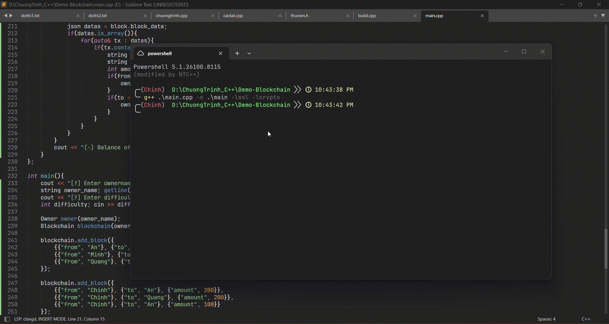

<p align="center">
  <a href="https://github.com/trgchinhh/library-C_healthy-cpp">
    
  </a>
  <a href="LICENSE">
    
  </a>
  <a href="https://github.com/trgchinhh">
    
  </a>
</p>

## Demo blockchain C++ (Nâng cấp RSA)

Dự án này là một ứng dụng giả lập (mô phỏng) mạng lưới Blockchain phân tán viết bằng ngôn ngữ C++. Phiên bản nâng cấp này tích hợp cơ chế bảo mật ví điện tử bất đối xứng bằng thuật toán RSA (thông qua thư viện Crypto++) và cơ chế đồng thuận Proof of Work (PoW) dựa trên hàm băm mật mã học SHA-256



## Tổng quan kiến trúc & Quy trình vận hành
Hệ thống hoạt động như một chu trình khép kín bao gồm 4 giai đoạn chính từ lúc khởi tạo người dùng cho đến khi khối được đóng vào chuỗi:

```bash
  [Khởi tạo Ví] ──> [Tạo & Ký Giao dịch] ──> [Xác thực Chữ ký] ──> [Đào Khối PoW] ──> [Thêm vào Chuỗi]
   (RSA Keys)         (Private Key)            (Public Key)         (Tìm Nonce)       (Liên kết Hash)
```

1. Khởi tạo định danh (Wallet Generation): Hệ thống tự động quét danh sách người dùng đầu vào, sinh ngẫu nhiên cặp khóa RSA (Khóa bí mật - Private Key và Khóa công khai - Public Key). Cặp khóa này được mã hóa dưới dạng Base64 và lưu trữ cục bộ vào 2 tệp tin cấu trúc JSON (private_keys.json và public_keys.json).

2. Khởi tạo và Ký giao dịch (Sign Transaction): Khi một giao dịch chuyển tiền ngẫu nhiên diễn ra, toàn bộ dữ liệu giao dịch (Người gửi, Người nhận, Số tiền, Chi phí, Mã giao dịch MD5, Thời gian) sẽ được gom lại thành một chuỗi văn bản gốc. Người gửi sử dụng Private Key của mình để thực hiện ký số, tạo ra mã chữ ký (Signature) dạng chuỗi Hex đính kèm vào gói giao dịch.

3. Xác thực giao dịch (Verify Transaction): Trước khi đưa dữ liệu vào khối để đào, Validator sẽ trích xuất thông tin giao dịch, lấy Public Key công khai của người gửi từ cơ sở dữ liệu để giải mã và xác thực chữ ký. Nếu dữ liệu bị chỉnh sửa dù chỉ 1 ký tự, chữ ký sẽ không hợp lệ và giao dịch bị hủy bỏ.

4. Đồng thuận đào block (Proof of Work): Giao dịch hợp lệ được đóng gói vào một Khối (Block). Miner/Validator tiến hành brute-force (thử sai) liên tục giá trị số nguyên Nonce bắt đầu từ 0 để băm toàn bộ khối bằng SHA-256. Quá trình dừng lại khi tìm được chuỗi Hash có số lượng ký tự 0 ở đầu bằng với độ khó Difficulty quy định. Khối mới tìm được liên kết với khối trước đó thông qua thông số Previous Hash

## Các tính năng nâng cấp nổi bật

* **Bảo mật ví điện tử (RSA Keypair):** Tự động sinh ngẫu nhiên cặp khóa Private Key (Bảo mật) và Public Key (Công khai) độ dài 1024-bit hoặc 2048-bit tùy chỉnh cho toàn bộ User, quản lý lưu trữ an toàn dưới dạng mã hóa Base64 trong tệp JSON
* **Chữ ký số giao dịch (RSA Signature):** Người gửi bắt buộc phải ký vào gói dữ liệu giao dịch bằng Private Key. Hệ thống sử dụng Public Key để verify, chống gian lận dữ liệu và mạo danh ví người khác
* **Mã hóa bất đối xứng:** Kết hợp bộ lọc mã hóa Crypto++ (`HexEncoder`, `Base64Decoder`) để đồng bộ hóa luồng dữ liệu nhị phân thô sang dạng chuỗi lưu trữ
* **Cơ chế Proof of Work (PoW):** Miner liên tục đào để tìm chỉ số `Nonce` để hàm băm SHA256 của toàn khối thỏa mãn độ khó (`Difficulty`) cấu hình trước.

---

## Yêu cầu hệ thống & Thư viện

Để biên dịch và chạy dự án này, hệ thống của bạn cần cài đặt các thư viện sau:

1.  **Crypto++ (cryptopp):** Thư viện mã hóa chuyên sâu phục vụ thuật toán ký RSA
2.  **OpenSSL (libssl & libcrypto):** Phục vụ cho các hàm băm cơ bản

### Hướng dẫn cài nhanh Crypto++ trên Windows (MinGW64 / MSYS2)

Mở terminal MSYS2 (UCRT64 hoặc MINGW64) trong bộ trình dịch MSYS2 và chạy lệnh:
```bash
# Đối với môi trường UCRT64 
pacman -S mingw-w64-ucrt-x86_64-cryptopp

# Đối với môi trường MINGW64 
pacman -S mingw-w64-x86_64-cryptopp
```

### Biên dịch và khởi chạy 
```bash
g++ main.cpp -o main.exe -lcryptopp -lssl -lcrypto
./main.exe
```

## Tác giả
**Nguyễn Trường Chinh (NTC++)**
GitHub: [https://github.com/trgchinhh](https://github.com/trgchinhh)

---

> 📌 Dự án nhỏ được phát triển với mục đích học tập và nghiên cứu. Mọi góp ý và đóng góp đều được hoan nghênh.
